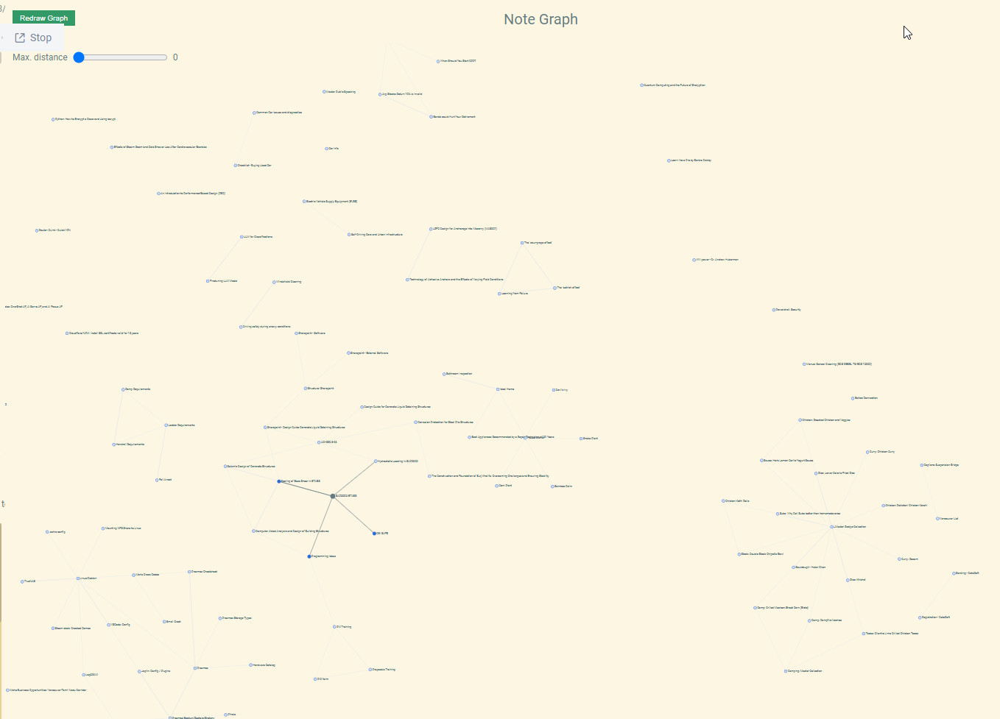

# Semantic Note Connector



> The screenshot above is generated using a Joplin link-graph plugin to visualize the connections created by this tool.

Semantic Note Connector automatically discovers semantic relationships between your Joplin notes and writes those connections back into the notes as internal links. This creates a rich “web of connections” that can be visualized by link-graph plugins and explored directly in Joplin.

No more manual Markdown exports or hand-wired “related notes” sections: the tool talks directly to Joplin’s Data API, computes similarities using an OpenAI-compatible embedding model, and keeps each note’s semantic connections up to date.

---

## Key Features

- **Direct Joplin Integration**
  - Uses the Joplin Data API via the `joppy` library.
  - No need to export Markdown files manually.

- **Semantic Connections Between Notes**
  - Generates embeddings for each note using a configurable embedding model.
  - Computes cosine similarity to find related notes.
  - Writes internal Joplin links back into each note under a dedicated section.

- **Stable, Idempotent Updates**
  - On every run, the tool fully regenerates its own managed section in each note.
  - Re-running with the same configuration and notes produces stable results.

- **Efficient Embedding Cache**
  - Caches embeddings in `embeddings_cache.json`, keyed by content hash.
  - Includes model metadata to avoid mixing incompatible embeddings.

- **Configurable Behavior**
  - Adjustable number of neighbors per note (`top_n`).
  - Minimum similarity threshold (`min_similarity`).
  - Exclude notes via tags (e.g. `no-semantic-links`, `Private`).
  - Optional “adapter-only” mode for external agents.

- **Automation-Friendly**
  - Designed to run non-interactively.
  - Driven entirely by `config.toml` and optional CLI flags.
  - Suitable for cron, Task Scheduler, or integration with LLM CLI agents.

---

## How It Works (Conceptual)

At a high level:

1. **Connect to Joplin**
   - The tool uses `joppy.client_api.ClientApi` to connect to Joplin Desktop’s Data API.
   - It performs a small health check (e.g., list notebooks) to validate connectivity.

2. **Fetch and Filter Notes**
   - Fetches all notes from Joplin with essential fields (ID, title, body, notebook, tags, updated time, todo flags, etc.).
   - Excludes notes that:
     - Are deleted or in conflict.
     - Are encrypted or otherwise unreadable.
     - Are completed to-dos (optional filter).
     - Have any tag listed in `joplin.exclude_tags` (case-insensitive).

3. **Strip Managed Section**
   - For each note, removes any previously generated semantic block:

     ```markdown
     <!-- semantic-note-connector:begin -->
     ## Semantic Connections
     ...
     <!-- semantic-note-connector:end -->
     ```

   - The resulting body is called `clean_body` and is what gets embedded.

4. **Generate or Reuse Embeddings**
   - Builds a text representation for each note:

     ```text
     {title}

     {clean_body}
     ```

   - Normalizes whitespace and computes a content hash.
   - Looks up the hash in `embeddings_cache.json`.
     - If found and cache metadata matches the current model, reuse.
     - If not, call the configured embedding endpoint via the `openai` client:
       - Enforce context window via `tiktoken` (truncate to `model_context` tokens).
     - Store new embeddings in the cache.

5. **Compute Similarities**
   - Uses `numpy` and `scikit-learn`’s `cosine_similarity` to compute pairwise similarities.
   - For each note:
     - Ranks other notes by similarity.
     - Keeps up to `top_n` neighbors with similarity ≥ `min_similarity`.
     - Breaks ties deterministically by title and ID.

6. **Update Notes**
   - For each note with at least one neighbor:
     - Re-checks `updated_time` from Joplin to detect concurrent edits.
     - If unchanged:
       - Writes a fresh semantic block at the end of the body:

         ```markdown
         <!-- semantic-note-connector:begin -->
         ## Semantic Connections

         1. [Some Related Note](:/NOTE_ID_1)
         2. [Another Related Note](:/NOTE_ID_2)
         <!-- semantic-note-connector:end -->
         ```

       - Links are standard Joplin internal links (`[Title](:/ID)`), so link-graph plugins can use them.
     - If `updated_time` changed, the note is skipped for safety and logged.
   - For notes with **no** neighbors above threshold:
     - Any existing semantic block is removed.

7. **Optional Global Report**
   - When enabled, writes `relevance_results.md` summarizing:
     - Run metadata (timestamp, model, thresholds).
     - For each note, its top neighbors with similarity scores and Joplin links.

---

## Requirements

### Joplin

- Joplin Desktop must be installed and running.
- The **Data API (Web Clipper API)** must be enabled:
  - In Joplin, go to Tools → Options → Web Clipper.
  - Enable the service and take note of the API token and port.

### Python & uv

- Python **3.13+** (or a version you manage via `uv`).
- [`uv`](https://docs.astral.sh/uv/) installed (`uv --version` should work).

The project is managed **only** via `uv` and `pyproject.toml`. You should not use `pip` or `requirements.txt` for this repository.

### Embedding Provider

You need an **OpenAI-compatible** embedding endpoint, such as:

- **Local**:
  - [Ollama](https://ollama.com/) with models like `nomic-embed-text` or `mxbai-embed-large`.
  - Any other local server that exposes an OpenAI-compatible `/embeddings` endpoint.
- **Cloud**:
  - OpenAI (`https://api.openai.com/v1`) or compatible providers.

> Privacy note: When using cloud APIs, your note content will be sent to that provider. Use a local LLM if you want everything to stay on your machine.

---

## Installation

Clone this repository:

```sh
git clone https://github.com/rpakishore/Joplin-Semantic-Note-Connector.git
cd Joplin-Semantic-Note-Connector
```

Install dependencies with:

```sh
uv sync
```

Run the connector:

```sh
uv run semantic-note-connector
```

---

## Configuration

Create your configuration file:

```sh
cp config_example.toml config.toml
```

Then edit `config.toml` to match your setup. The **target** structure (some fields may be added as the new implementation lands) is:

```toml
[llm]
url = "http://localhost:11434/v1"
key = "ollama"              # or OpenAI key, see privacy notes
model = "nomic-embed-text"
model_context = 8192
fallback_encoding = "cl100k_base"

[joplin]
base_url = "http://127.0.0.1:41184"
token = "YOUR_JOPLIN_TOKEN"
exclude_tags = ["no-semantic-links", "Private"]

[semantic]
top_n = 5
min_similarity = 0.6
generate_global_report = true
mode = "local-embed"        # or "adapter-only"
dry_run = false
max_notes = 5000
notes_dump_path = "notes_dump.json"
connections_update_path = "connections_update.json"
verbose = false
```

### Environment Variable Overrides

- `LLM_API_KEY` overrides `[llm].key`.
- `JOPLIN_TOKEN` overrides `[joplin].token`.
- `SEMANTIC_CONNECTOR_CONFIG` can point to an alternate config file.

This allows you to keep secrets out of version-controlled files.

---

## Usage

Typical usage:

- Standard run (local embeddings):
  ```sh
  uv run semantic-note-connector
  ```
- Adapter-only mode (no embeddings, JSON in/out):
  ```sh
  uv run semantic-note-connector --mode adapter-only
  ```
- Dry-run preview:
  ```sh
  uv run semantic-note-connector --dry-run
  ```

---

## Privacy & Security

- Your notes’ contents are sent to whichever embedding endpoint you configure.
  - Use a local endpoint (e.g., Ollama) if you want to keep data on your machine.
- API keys and tokens:
  - Must never be committed to version control.
  - Prefer environment variables for secrets.
- The tool:
  - Does **not** log note bodies or large snippets.
  - Logs only IDs, titles, and high-level counts.

---

## Motivation

Over time, a personal knowledge base (PKM) or note system like Joplin grows into thousands of notes. While tags and notebooks help, many of the most interesting connections between ideas are never made explicit.

Semantic Note Connector aims to:

- Uncover **hidden relationships** between notes you may have forgotten.
- Help you **navigate by meaning**, not just keywords.
- Provide **machine-maintained internal links** that your graph plugins and search tools can build on top of.

You keep writing notes as usual; the tool keeps your web of connections alive.

---

## Roadmap & Future Enhancements

Planned or potential improvements (not all implemented yet):

- **Incremental recomputation**
  - Only recompute embeddings and similarities for notes whose content changed since the last run.

- **Include filters**
  - Ability to process only certain notebooks or tags, in addition to exclude-tags.

- **Per-notebook thresholds**
  - Different `top_n` / `min_similarity` per notebook or tag.

- **Scalability**
  - Optional approximate nearest neighbor search for very large note collections.

- **Richer reports or UI**
  - More detailed overviews, or export for external graph tools.

For implementation details and the most up-to-date behavior, see `AGENTS.md` (developer view) and `Deployment.md`.
