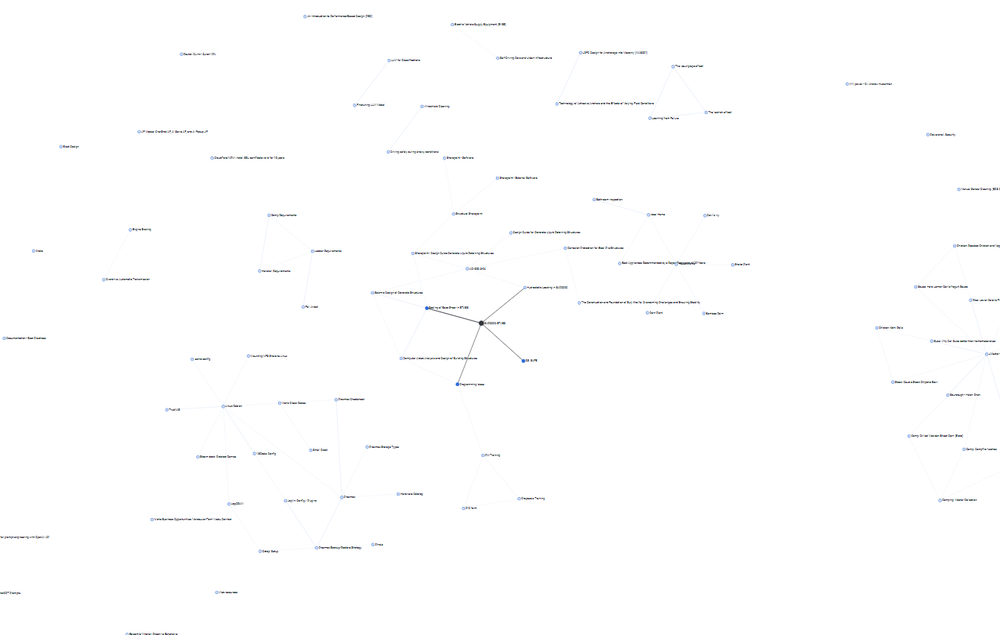

# Semantic Note Connector

## Screenshot



The above screenshot was auto-generated using [Link Graph UI Plugin for Joplin](https://github.com/treymo/joplin-link-graph)

## Overview

The Semantic Note Connector is a Python script designed to analyze Markdown notes. It identifies semantically similar notes by leveraging language model embeddings and cosine similarity. This tool helps you uncover hidden connections, rediscover related ideas, and gain new insights from your knowledge base.

## Features

* **Semantic Similarity Analysis:** Calculates the semantic relevance between all your Joplin notes.
* **Flexible LLM Integration:** Uses an OpenAI-compatible API, allowing you to connect to various embedding models (e.g., local models via Ollama, or commercial APIs like OpenAI).
* **Efficient Caching:** Caches generated embeddings to `embeddings_cache.json`, significantly speeding up subsequent runs and minimizing API calls for unchanged notes.
* **Content Handling:**
    * Automatically truncates notes that exceed the configured language model's context window.
    * Handles empty or very short notes gracefully.
* **Clear Reporting:** Outputs a well-structured Markdown file (`relevance_results.md`) detailing the most relevant notes for each document, along with their similarity scores.
* **User-Friendly Configuration:** API endpoint, model name, and context length are easily configured via a `config.toml` file.

## How it Works

The script follows these steps to find related notes:

1.  **Load Notes:** It prompts you for the directory containing your Markdown exports and reads all `.md` files within it.
2.  **Generate Embeddings:** For each note's content:
    * It calculates a unique hash of the content.
    * If an embedding for this hash already exists in `embeddings_cache.json`, it's retrieved from the cache.
    * Otherwise, the script sends the note's content to the configured LLM API to generate a numerical representation (embedding).
    * If a note's content is too long for the LLM's context window (defined in `config.toml`), the content is truncated before generating the embedding.
    * Empty notes are processed by sending a single space to the embedding API to avoid errors, though they won't yield meaningful similarity scores.
    * The new embedding is then saved to the cache.
3.  **Calculate Similarity:** Once embeddings are generated for all notes, the script computes the cosine similarity between each note's embedding and the embeddings of all other notes.
4.  **Generate Report:** Finally, it creates (or overwrites) the `relevance_results.md` file. This report lists each processed note and its top N most semantically similar notes, along with their respective similarity scores and file paths.

## Prerequisites

Before you begin, ensure you have the following installed and set up:

* **Python:** Version 3.13 or higher.
* **`uv`:** A fast Python package installer and project manager. If you don't have it, you can find installation instructions on the [official `uv` GitHub page](https://github.com/astral-sh/uv).
* **Joplin Desktop Application:** You'll need this to export your notes.
* **Access to an OpenAI-compatible API for Embeddings:**
    * This could be a locally running instance of an LLM server like [Ollama](https://ollama.com/) serving an embedding model (e.g., `nomic-embed-text`, `mxbai-embed-large`, `mistral`, `llama3`).
    * Alternatively, you can use a cloud-based service like the OpenAI API.

## Setup

Follow these steps to set up the project:

1.  **Get the Script:**
    * If you cloned a repository:
        ```bash
        git clone https://github.com/rpakishore/Joplin-Semantic-Note-Connector.git
        cd "Joplin-Semantic-Note-Connector"
        ```
    * Otherwise, ensure `process.py` and `config_example.toml` are in the same directory.

2.  **Configure API Access:**
    * The script requires a `config.toml` file to know which LLM to use and how to connect to it. Copy the example configuration:
        ```bash
        cp config_example.toml config.toml
        ```
    * Edit the newly created `config.toml` file with your specific LLM API details. See the [Configuration (`config.toml`)](#configuration-configtoml) section below for guidance.

3.  **Export Joplin Notes:**
    * Open your Joplin Desktop application.
    * Navigate to `File` > `Export all`.
    * In the export dialog, choose `MD - Markdown` as the format.
    * Select an empty local directory where you want to save your exported Markdown files. **Remember this directory path**, as you'll need it when running the script.

## Running the Script

1.  Open your terminal or command prompt.
2.  Navigate to the directory where `process.py` and your `config.toml` file are located.
3.  Execute the script using `uv`:
    ```bash
    uv run --script process.py
    ```
    `uv` will automatically handle the dependencies listed at the top of the `process.py` file.

4.  The script will then prompt you for two pieces of information:
    * **Path to your Joplin Markdown notes directory:** Enter the full path to the directory where you exported your notes in the setup step.
    * **Number of relevant documents:** Enter how many of the most similar notes you want to see listed for each document (e.g., `5`). If you press Enter without typing a number, it defaults to 5.

5.  The script will start processing your notes. This may take some time, especially on the first run or with a large number of notes, as it needs to generate embeddings. Subsequent runs will be faster for notes that haven't changed, thanks to the cache.

6.  Once completed, the script will save the results in `relevance_results.md` and update the `embeddings_cache.json` file. You'll see a confirmation message in the console.

## Configuration (`config.toml`)

The `config.toml` file is crucial for telling the script how to connect to your chosen language model API for generating embeddings. Here's an example and explanation of its fields:

```toml
[llm]
# Name of the embedding model to use. This must match a model
# available at your API endpoint.
# Example for Ollama: "nomic-embed-text", "mxbai-embed-large", "mistral"
# Example for OpenAI API: "text-embedding-ada-002", "text-embedding-3-small"
model = "nomic-embed-text"

# Context window size of the model in tokens.
# You should check your specific model's documentation for this value.
# For nomic-embed-text (via Ollama), this is often 8192.
# For OpenAI's text-embedding-ada-002, it's 8191.
model_context = 8192

# Base URL of the OpenAI-compatible API.
# Example for a local Ollama instance (default port): "http://localhost:11434/v1"
# Example for OpenAI API: "[https://api.openai.com/v1](https://api.openai.com/v1)"
url = "http://localhost:11434/v1"

# API key for the service.
# For a local Ollama setup, this can often be a non-empty placeholder string
# like "ollama", "placeholder", or any other string.
# For OpenAI, this must be your actual OpenAI API key.
key = "ollama"

```

## Output

The script produces two main outputs:

1. `embeddings_cache.json`:
   - This file stores the generated embeddings for your notes.
   - It uses a content hash to identify notes, so embeddings are only re-generated if a note's content changes.
   - This speeds up subsequent runs significantly.

2. `relevance_results.md`:
   - A Markdown file containing the analysis results.
   - For each processed document, it lists the most relevant other documents based on semantic similarity, along with their similarity scores.
   - It includes the source directory, the number of documents processed, and the requested number of top N relevant documents.

## Caching

The script uses a caching mechanism (`embeddings_cache.json`) to store generated embeddings.

- Before generating an embedding for a document, the script calculates a SHA256 hash of its content.
- It checks if an embedding for this hash already exists in the cache.
    - If found, the cached embedding is used.
    - If not found, a new embedding is generated via the API, and then stored in the cache with its content hash.
- This significantly reduces API calls and processing time on subsequent runs, especially if notes haven't changed.
- The cache is automatically loaded at the start and saved if any new embeddings are generated.

## Next Steps (Based on Script Output)

After running the script and reviewing `relevance_results.md`:

1. Review the relevance scores in the generated report.
2. If using this with Joplin, you might want to map the reported file paths to Joplin Note IDs (e.g., `:/NOTE_ID_HERE`) to create internal links within Joplin. The script identifies relevant file paths based on their content similarity; further mapping to Joplin's internal linking system would be a manual or separate process.